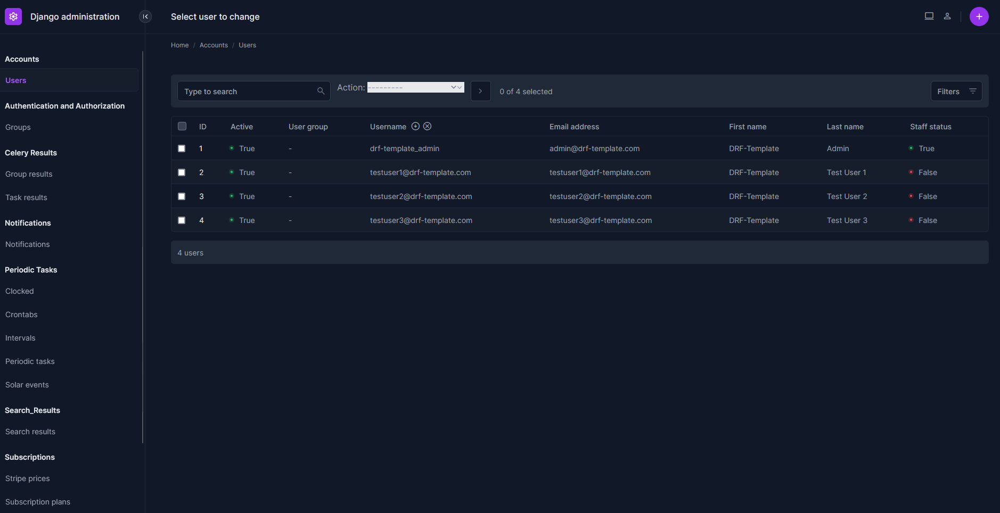
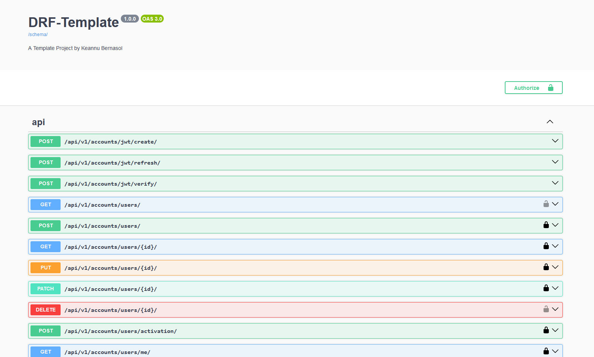
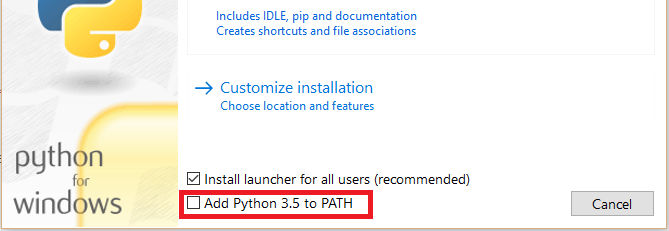
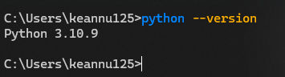
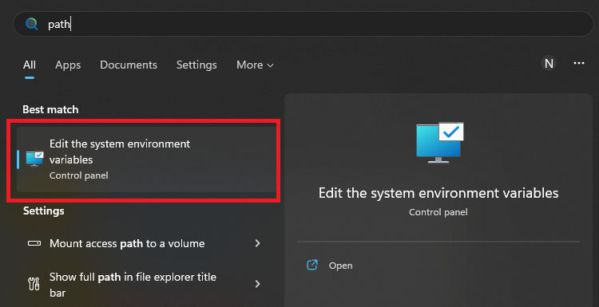
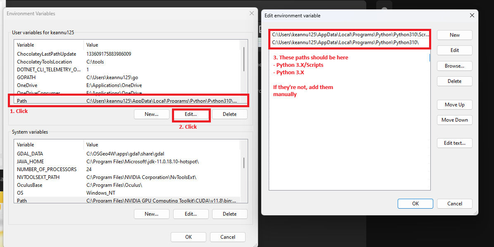
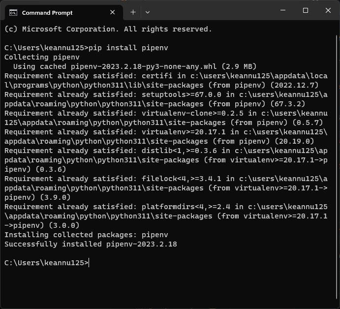
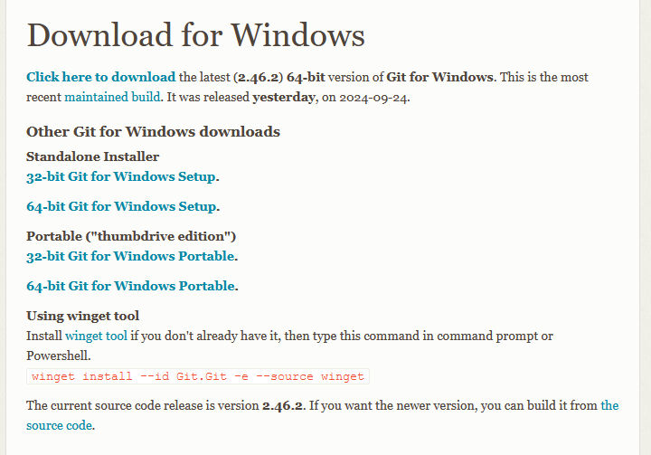
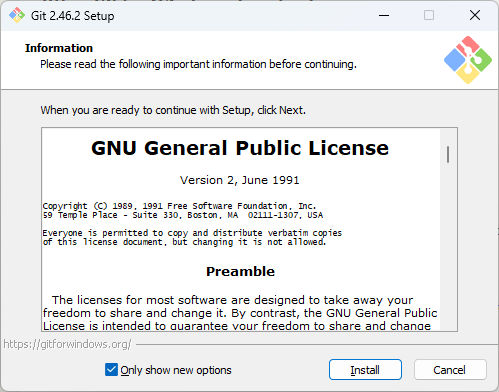

# Setup

### Overview

Django is a framework built with Python to help you implement web applications.





Django can be used as-is to develop full stack web apps which include your frontend and backend. This however isn't the focus of this guide.

You will be using Django alongside Django REST Framework to instead build a backend API, which will only serve data from your database, and not serve as a frontend framework. This guide will focus on data, so no fancy frontend design stuff!

This guide has concepts that are similar to the official guide for Django linked [here](https://docs.djangoproject.com/en/5.1/intro/tutorial01/). Check it out as well!

### Getting Started

You will need to install the latest version of Python (version 3.11.2 as of 2/19/2023)

[<span style="margin: 0px; padding: 0px; border: 0px; font-weight: inherit; font-style: inherit; font-family: inherit; font-size: 16px; vertical-align: baseline; outline: 0px;">https://www.python.org/downloads/</span>](https://www.python.org/downloads/ "https://www.python.org/downloads/")

<span style="margin: 0px; padding: 0px; border: 0px; font-weight: inherit; font-style: inherit; font-family: inherit; font-size: 16px; vertical-align: baseline; outline: 0px;">During the installation, make sure to check **Add Python 3.x to PATH**</span>



To check if you have a working install, open a command line (CMD) and type in `python --version`



If this does not work, you will have to check your PATH variables. If it does, you can safely proceed to the next step.





### Install [Pipenv](https://pipenv.pypa.io/en/latest/)

When working with Python projects, you will have multiple dependencies.

One of your Python projects may require these package versions

```
whitenoise==6.6.0
gunicorn==22.0.0
```

While another might require an older version

```
whitenoise==5.6.0
gunicorn==21.0.0
```

Managing dependencies in a single installation is a nightmare you definitely don't want to deal with. Using Pipenv, or other alternatives like Python venv (which is not discussed in this guide) will help you avoid these issues.

Open up a command line (CMD) and type in `pip install --user pipenv` to install Pipenv

This will use the package manager for Python (akin to npm for Javascript/Typescript projects) to install the Pipenv package



### Install [Git](https://git-scm.com/downloads)

When developing applications, you will need to use version control to track changes.

Head over to the [downloads](https://git-scm.com/downloads/win) page and install the 64-bit Git for Windows Setup version (Standalone Installer)


This guide does not cover the proper usage of Git and so you may need to look up for other resources if you are not familiar with it yet.


You can proceed with the typical installation using defaults (no need to change anything), just click Next/Install.

With that out of the way, you can proceed to setting up your Django REST Framework project.
