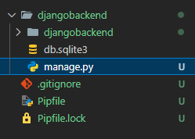
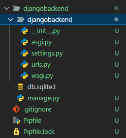
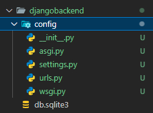
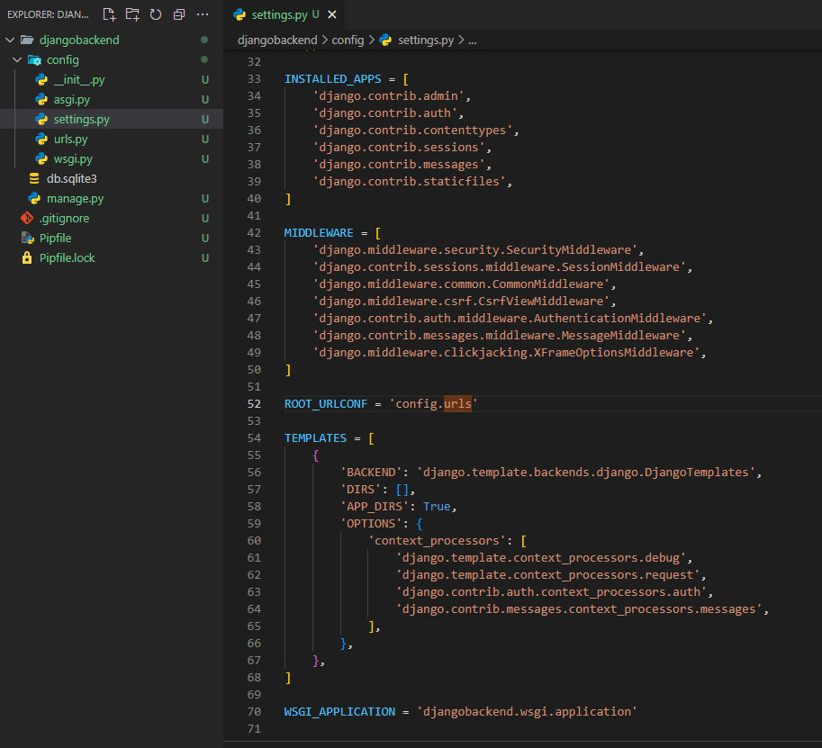
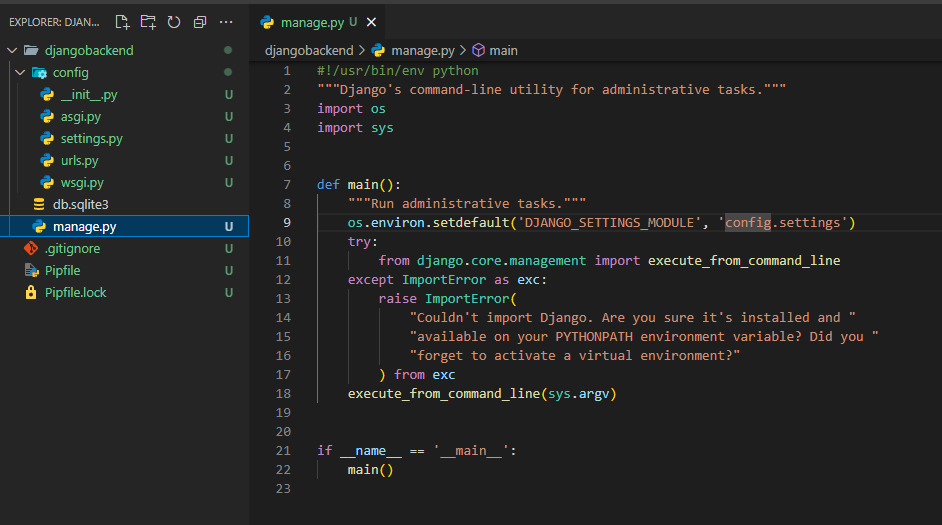
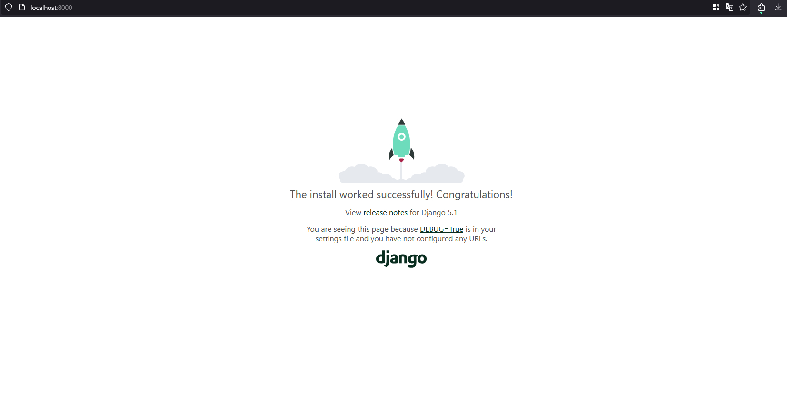
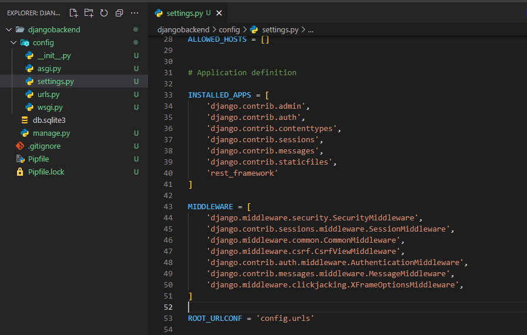

# Project Structure

### Folder Hierarchy

Your project's root folder (the outer most) contains the following

- `Pipfile`, `Pipfile.lock` - to track your installed packages as mentioned previously
- `.gitignore` - to exempt some files from being tracked in your version control (Git)

#### Project Folder

The folder immediately proceeding your first one contains your Django project, created by the command `django-admin startproject PROJECT\_NAME` which you previously executed

This contains the following

- `manage.py` - The entry point to your Django app (e.g. the `python manage.py runserver` command and such)
- `db.sqlite3` - The default database file for Django, which uses [SQLite](https://www.sqlite.org/) (you can switch to PostgreSQL or MySQL later on)
- Another folder which contains your project's main config or app

#### Django Apps  

Django divides your projects into groups called apps. When you start a new project, you start off with your first app.

In this case, my first app is named `djangobackend`

That seems a bit confusing doesn't it?

#### Renaming the Config App

To make things clearer, you can opt to rename the main app of your Django project. These are the changes you must make

- Rename the main app folder to `config`

- Open `asgi.py` and change line 14 to point to **config.settings** instead of **PROJECT_NAME.settings**

- Do the same for the `wsgi.py` file, also in line 14

- Go to `settings.py` and set **ROOT_URLCONF** in line 52 to **config.urls** instead of **PROJECT_NAME.urls**

- Do the same for **WSGI_APPLICATION** in `settings.py`, line 70

- In `manage.py`, change line 19 to point to **config.settings** instead of **PROJECT_NAME.settings**

[

With that, you should be good to go. Double check your setup by starting the Django app once again

If you followed everything correctly, you should see the same page as before

### Setting up DRF

Your current setup only includes Django. To proceed with Django REST Framework, we will need to add it to our project.

You've already installed Django REST Framework in the previous steps (e.g. `pipenv install django djangorestframework`).

To register it as an app in our project. Open your `settings.py` file and look for the **INSTALLED_APPS** section

Add **rest_framework** to **INSTALLED_APPS**

The next section will then tackle building a REST API with DRF