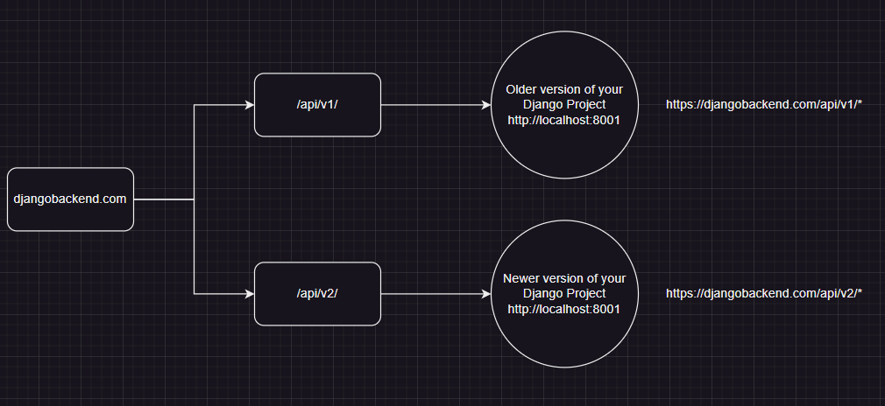
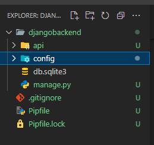
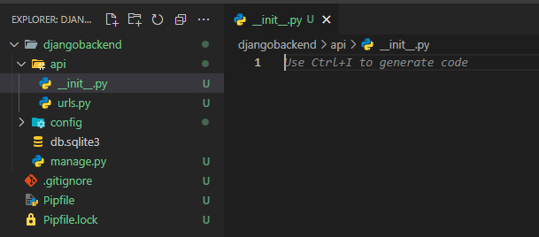
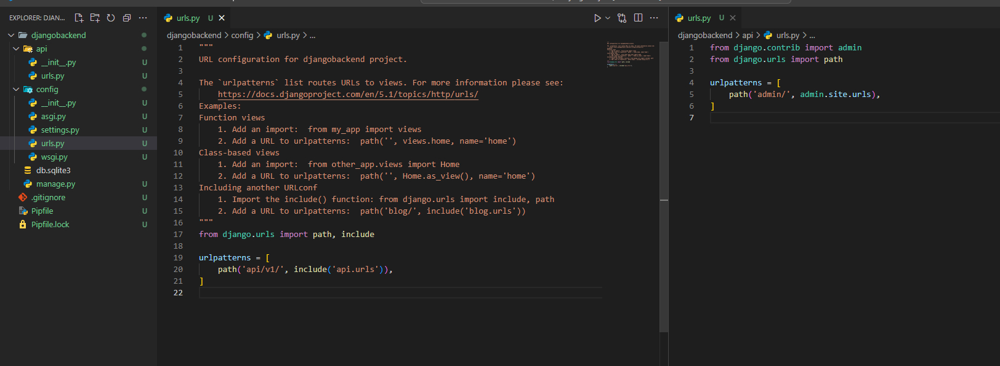

# REST Framework Setup

### API App

When writing backend APIs, you make changes to your app that may not be compatible with older versions.

Examples of these include the following;

- You changed what should be sent to your login API in order to authenticate with a newer version of your backend
- When requesting books from your database, a newer version of your API may return a different format (XML instead of JSON)

You should take this into account when building a new project, otherwise users on older versions may encounter errors.



This lets you allow users on older versions to still use your app (v1) while allowing newer users without any overlap (v2)

We will structure your project in the same manner as above. Create a folder named `api` in your Django project folder besides **config**



Create the following files inside the `api` folder

- `__init__.py`
- `urls.py`


Leave **\_\_init\_\_.py** blank. Instead, open **urls.py** and add the following code

```python
from django.contrib import admin
from django.urls import path

urlpatterns = [
    path('admin/', admin.site.urls),
]
```

We will then need to point the main config's url file **(url.py)** to the one we just created. Open the **urls.py** file in the **config** folder, replace it with the following

```python
from django.urls import path, include

urlpatterns = [
    path('api/v1/', include('api.urls')),
]
```

Your setup should then look like this

[](https://bookstack.06222001.xyz/uploads/images/gallery/2024-09/2gZimage.png)

[](https://bookstack.06222001.xyz/uploads/images/gallery/2024-09/70bimage.png)

There is no need to include the **api** app in your **INSTALLED\_APPS (config/settings.py)**

The next section will handle users and authentication