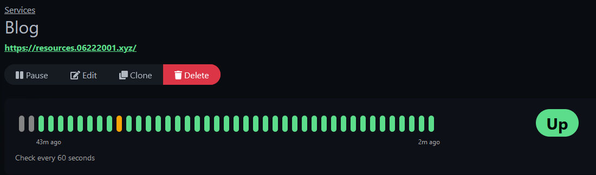
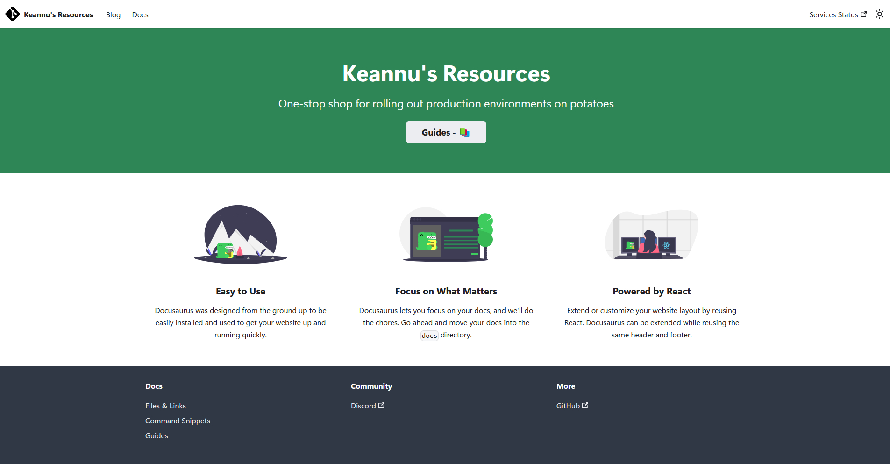

A GitHub mirror of my [Obsidian](https://obsidian.md/) blog posts, guides, and public notes.

A [Docusaurus](https://github.com/facebook/docusaurus) instance also serves these notes at my own `.xyz` subdomain [here](https://resources.06222001.xyz)

An alternative Git mirror is available in my [Gitea](https://about.gitea.com/) instance [here](https://git.06222001.xyz/keannu125/Notes)
