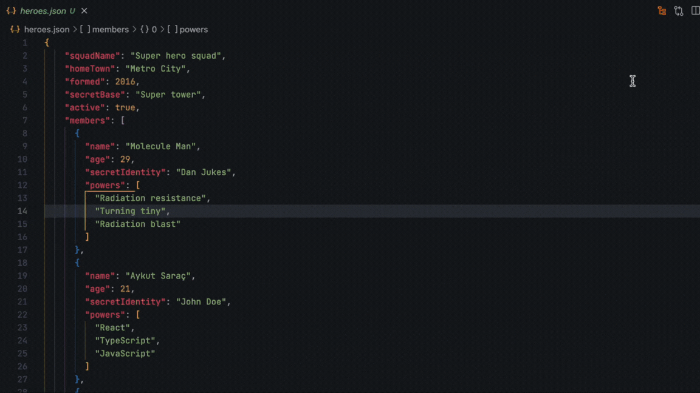

### Browser Extensions
- [https://github.com/Dj0ulo/OptiSearch](https://github.com/Dj0ulo/OptiSearch)
### VSCode
#### Custom VSCode Theme
  - [Fluent-UI-VSCode](https://marketplace.visualstudio.com/items?itemName=leandro-rodrigues.fluent-ui-vscode)
  - [VSCode Vibrancy Continued](https://marketplace.visualstudio.com/items?itemName=illixion.vscode-vibrancy-continued)
  - Terminal tab may be broken. You can fix it by following the GitHub issue [here](https://github.com/TheOld/vscode-fluent-ui/issues/53)
	  Edit `workbench.html` file at `Microsoft VS Code\resources\app\out\vs\code\electron-sandbox\workbench`
#### [JSON Crack](https://marketplace.visualstudio.com/items?itemName=AykutSarac.jsoncrack-vscode)

  

